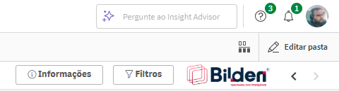
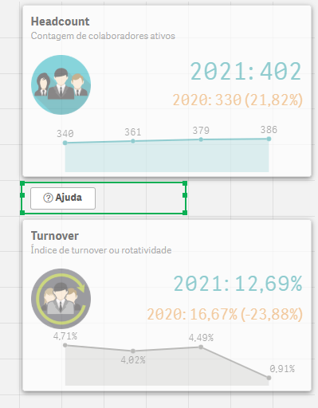
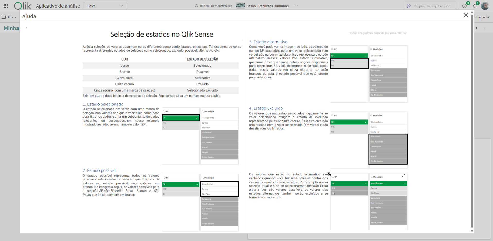
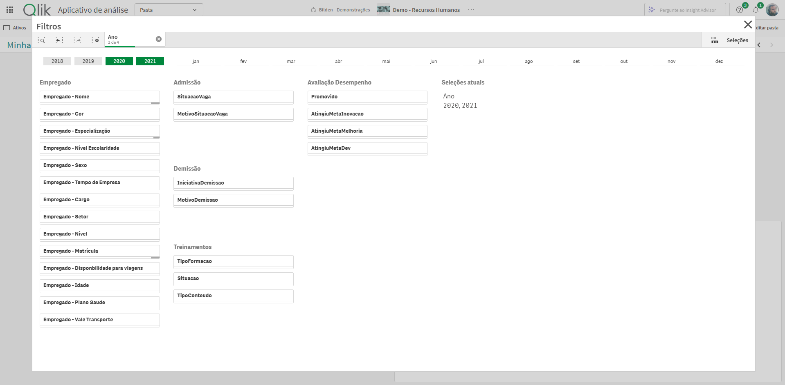
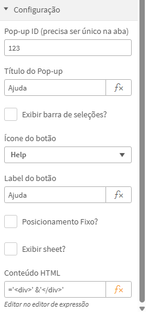
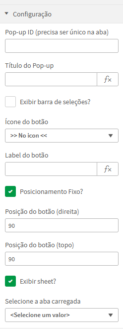

> 📄 This content is in Portuguese. For the English version, [click here](./README.en.md).

# Bilden Popup

Extensão para Qlik Sense que permite exibir janelas modais (pop-ups) sobre o dashboard, com suporte a conteúdo HTML estático ou exibição de uma aba (sheet) do próprio aplicativo.

> Desenvolvido por [Rodrigo Martins - Bilden](https://bildennegocios.com/)  
> Compatível com Qlik Cloud e Qlik Sense On-Premise

---

## 📌 Visão Geral

O **Bilden Popup** é uma extensão visual pensada para enriquecer a experiência dos usuários no Qlik Sense, permitindo:

- Exibir um conteúdo de **ajuda**, **instrução**, **tutoriais**, **painéis secundários**, **documentações** ou qualquer outro material complementar sem sair da tela atual.
- Embutir um **HTML personalizado** (com imagem, texto, PDF, iframe, etc.) ou carregar diretamente uma **sheet do Qlik**.
- Customizar posição, ícone, título, e comportamento do botão de chamada do popup.

---

## 🚀 Funcionalidades

- ✅ Exibição de **HTML customizado**, com suporte a expressões Qlik.
- ✅ Exibição de uma **aba (sheet)** do próprio app.
- ✅ Opções de **posicionamento fixo** do botão de disparo (topo/direita).
- ✅ Exibição opcional da **barra de seleções** dentro do popup.
- ✅ Suporte a ícones de botão customizados.
- ✅ Compatível com **Qlik Cloud** e **Qlik Sense Client-Managed**.

---

## 🔎 Exemplos

Posição fixa - o botão é exibido de acordo com a configuração (topo/direita):

Sem posição fixa (o botão é exibido dentro do componente):

Conteúdo HTML (nesse caso uma imagem):

Conteúdo onde uma aba do aplicativo é carregada (uma aba apenas com filtros do app):

---

## 🔧 Parâmetros de Configuração

| Campo                      | Descrição                                                                 |
|---------------------------|---------------------------------------------------------------------------|
| `Pop-up ID`               | ID único por aba — usado internamente.                                    |
| `Título do Pop-up`        | Cabeçalho exibido no topo da janela do popup.                             |
| `Exibir barra de seleções?` | Exibe ou não a barra de seleções dentro do popup.                         |
| `Ícone do botão`          | Ícone exibido no botão de chamada.                                        |
| `Label do botão`          | Texto exibido no botão.                                                   |
| `Posicionamento Fixo?`    | Habilita o posicionamento com coordenadas absolutas.                      |
| `Posição do botão (direita)` | Distância da borda direita em pixels.                                   |
| `Posição do botão (topo)` | Distância da borda superior em pixels.                                    |
| `Exibir sheet?`           | Define se será exibida uma sheet ou um HTML.                              |
| `Selecione a aba carregada` | Sheet que será carregada no popup, se a opção anterior estiver ativada. |
| `Conteúdo HTML`           | HTML a ser renderizado no popup. Pode conter imagens, iframes, PDFs etc. |

---

## 📂 Instalação

### Para Qlik Cloud:
1. Acesse o **Management Console**.
2. Vá para **Extensions** e clique em **Add**.
3. Selecione o `.zip` da extensão e envie.

👉 Veja a [documentação oficial](https://help.qlik.com/pt-BR/cloud-services/Subsystems/Hub/Content/Sense_Hub/Admin/mc-extensions.htm).

### Para Qlik Sense On-Premise:
1. Acesse o **Qlik Management Console (QMC)**.
2. Vá em **Extensões > Importar**.
3. Selecione o `.zip` da extensão e clique em **Importar**.

👉 Veja a [documentação oficial](https://help.qlik.com/en-US/sense-admin/May2025/Subsystems/DeployAdministerQSE/Content/Sense_DeployAdminister/QSEoW/Administer_QSEoW/Managing_QSEoW/import-extensions.htm)

---

## 🛠 Desenvolvimento
Esta extensão foi desenvolvida utilizando o pacote [qExt](https://github.com/axisgroup/qExt), que facilita a criação, empacotamento e deploy de extensões para o Qlik Sense. A estrutura de pastas e scripts foi baseada no template oficial do qExt, e pode ser customizada conforme a necessidade.  
Mais informações: https://github.com/axisgroup/qExt

## 📎 Licença

MIT License © Rodrigo Martins / Bilden  
Fique à vontade para adaptar, melhorar e contribuir.

---

## 🙋‍♂️ Suporte & Contato

Problemas ou sugestões?  
Abra uma [issue aqui no GitHub](https://github.com/drigomed/bilden-popup/issues) ou entre em contato:

- [LinkedIn - Rodrigo Martins](https://www.linkedin.com/in/drigomed)
- [https://bildennegocios.com/](https://bildennegocios.com/)
